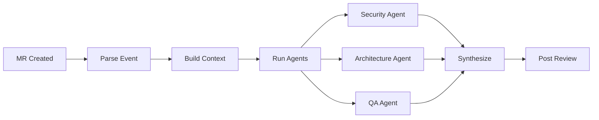

# 🤖 AI Code Reviewer

**Autonomous AI agent for intelligent code review in CI/CD pipelines**

[](https://www.python.org/downloads/)
[](https://www.apache.org/licenses/LICENSE-2.0)
[](https://github.com/astral-sh/ruff)

---

## ✨ Features

- 🚀 **1-Minute Setup** — Start reviewing code in under a minute
- 🧠 **Multi-LLM Support** — Claude, GPT, Gemini, DeepSeek, Ollama
- 💰 **Cost Optimized** — Hybrid approach: local + cloud LLMs
- 🔍 **Smart Analysis** — Security, architecture, QA agents
- 🎯 **Context Aware** — Learns from your codebase
- 🛡️ **Production Ready** — Error handling, metrics, observability
- 🔧 **Highly Configurable** — 3 deployment scenarios out-of-the-box

---

## 🎯 Quick Start (1 Minute)

```bash
# 1. Install
pip install ai-code-reviewer

# 2. Configure (get free API key from Google AI Studio)
export GOOGLE_API_KEY=your_key_here

# 3. Review!
ai-review github --pr-number $PR_NUMBER --repo owner/repo
```

That's it! 🎉

See [Quick Start Guide](https://konstziv.github.io/ai-code-reviewer/getting-started/quick-start/) for details.

---

## 📦 Installation

### From PyPI (when published)
```bash
pip install ai-code-reviewer
```

### From Source
```bash
git clone https://github.com/KonstZiv/ai-code-reviewer.git
cd ai-code-reviewer

# Using uv (recommended - 10-100x faster)
uv venv
source .venv/bin/activate  # Linux/Mac
uv sync --all-groups       # Install all dependencies (PEP 735)
uv run pre-commit install

# Or using pip (if you must)
python -m venv .venv
source .venv/bin/activate
pip install -e ".[dev]"
pre-commit install
```

---

## 🚀 Deployment Scenarios

### 1. Solo Developer (FREE)
**Perfect for:** Personal projects, testing
**Cost:** $0 (uses free tiers)
**Setup:** 1 minute

```yaml
# .github/workflows/ai-code-review.yml
name: AI Code Review
on:
  pull_request:

jobs:
  review:
    runs-on: ubuntu-latest
    steps:
      - uses: actions/checkout@v4
      - uses: actions/setup-python@v5
        with:
          python-version: "3.13"
      - run: pip install ai-code-reviewer
      - run: ai-review github --pr-number ${{ github.event.pull_request.number }}
        env:
          GITHUB_TOKEN: ${{ secrets.GITHUB_TOKEN }}
          GOOGLE_API_KEY: ${{ secrets.GOOGLE_API_KEY }}
```

[Full Guide →](https://konstziv.github.io/ai-code-reviewer/guides/github-actions/)

---

### 2. Small Team ($10-30/month)
**Perfect for:** Startups, small teams (2-10 devs)
**Cost:** ~$10-30/month
**Features:** Multiple agents, hybrid LLM routing

```yaml
llm:
  providers:
    - anthropic  # Quality
    - google     # Cost
  strategy: balanced
```

[Full Guide →](https://konstziv.github.io/ai-code-reviewer/deployment/small-team/)

---

### 3. Enterprise (Self-Hosted)
**Perfect for:** Large teams, companies
**Cost:** Infrastructure + modest API costs
**Features:** Local LLMs, webhooks, full observability

```yaml
llm:
  providers:
    - local      # Ollama (free)
    - anthropic  # Complex tasks

webhook:
  enabled: true

metrics:
  backend: prometheus
```

[Full Guide →](https://konstziv.github.io/ai-code-reviewer/deployment/enterprise/)

---

## 🧠 How It Works



1. **Parse Event** — Detect MR/PR creation or update
2. **Build Context** — Gather code, history, dependencies
3. **Run Agents** — Parallel analysis by specialized agents
4. **Synthesize** — Combine findings into coherent feedback
5. **Post Review** — Constructive comments in MR/PR

[Architecture Deep Dive →](https://konstziv.github.io/ai-code-reviewer/guides/architecture/)

---

## 🎨 Example Review

<details>
<summary>Security Agent finds hardcoded secret</summary>

```python
# ❌ Issue Found
API_KEY = "sk-1234567890abcdef"  # Line 15

# 💬 Comment Posted
🚨 **Hardcoded Secret Detected**

Found what appears to be an API key on line 15.

**Risk:** High - Credentials in code can be exposed in version control

**Recommendation:**
Use environment variables or a secrets manager:

```python
import os
API_KEY = os.getenv("API_KEY")
if not API_KEY:
    raise ValueError("API_KEY environment variable not set")
```

See: [OWASP Secrets Management](https://cheatsheetseries.owasp.org/cheatsheets/Secrets_Management_Cheat_Sheet.html)
```
</details>

---

## 🛠️ Configuration

### Basic (.env file)
```bash
# At least one LLM provider
ANTHROPIC_API_KEY=sk-ant-...
GOOGLE_API_KEY=...
OPENAI_API_KEY=sk-...

# Git platform
GITHUB_TOKEN=ghp_...
```

### Advanced (config.yml)
```yaml
llm:
  providers: [anthropic, google]
  strategy: balanced
  cost_budget_per_review: 0.15

review:
  analysis_depth: normal
  enabled_agents:
    - security
    - architecture
    - qa
```

[Full Configuration Guide →](https://konstziv.github.io/ai-code-reviewer/configuration/)

---

## 🧪 Development

### Setup
```bash
# Clone
git clone https://github.com/KonstZiv/ai-code-reviewer.git
cd ai-code-reviewer

# Install uv (fast package manager)
curl -LsSf https://astral.sh/uv/install.sh | sh

# Setup environment
uv venv
source .venv/bin/activate
uv sync --all-groups

# Setup pre-commit hooks
uv run pre-commit install

# Configure
cp .env.example .env
# Edit .env with your API keys

# Test
uv run pytest
uv run ruff check .
uv run mypy src/
```

### Quick Commands

```bash
# Run tests
uv run pytest

# Check code quality
uv run ruff check .
uv run ruff format .
uv run mypy src/

# Run pre-commit manually
uv run pre-commit run --all-files

# Build docs
uv run mkdocs serve
```

Or use Makefile:
```bash
make setup    # Complete setup
make test     # Run tests
make lint     # Check code quality
make format   # Format code
make docs     # Serve documentation
```

### Project Structure
```
ai-code-reviewer/
├── GENERAL_PROJECT_DESCRIPTION/  # Project docs
├── CURRENT_TASK/                 # Active work
├── src/ai_reviewer/              # Source code
│   ├── core/                     # Models, orchestrator
│   ├── agents/                   # Review agents
│   ├── llm/                      # LLM router
│   └── integrations/             # Git platforms
├── tests/                        # Tests
├── docs/                         # MkDocs documentation
└── config/                       # Deployment configs
```

[Contributing Guide →](GENERAL_PROJECT_DESCRIPTION/CONTRIBUTING.md)

---

## 📚 Documentation

Full documentation: [https://konstziv.github.io/ai-code-reviewer](https://konstziv.github.io/ai-code-reviewer)

- [Quick Start](https://konstziv.github.io/ai-code-reviewer/getting-started/quick-start/)
- [Deployment Guides](https://konstziv.github.io/ai-code-reviewer/deployment/)
- [Configuration](https://konstziv.github.io/ai-code-reviewer/configuration/)
- [API Reference](https://konstziv.github.io/ai-code-reviewer/api/)
- [Development](https://konstziv.github.io/ai-code-reviewer/development/)

---

## 🤝 Contributing

We welcome contributions! This project is designed for **human-AI pair programming**.

1. Read [CONTRIBUTING.md](GENERAL_PROJECT_DESCRIPTION/CONTRIBUTING.md)
2. Check [CURRENT_TASK](CURRENT_TASK/) for active work
3. Review [PROJECT_CANVAS](GENERAL_PROJECT_DESCRIPTION/PROJECT_CANVAS.md)

---

## 📊 Roadmap

### Phase 1: MVP (Current)
- [x] Project structure
- [ ] Multi-LLM router
- [ ] First agent (Security)
- [ ] GitHub integration
- [ ] Quick-start deployment

### Phase 2: Core Features
- [ ] 3 agents (Security, Architecture, QA)
- [ ] Repository context
- [ ] Small-team deployment

### Phase 3: Advanced
- [ ] Local LLM (Ollama)
- [ ] Webhook mode
- [ ] Enterprise deployment
- [ ] Metrics dashboard

[Full Roadmap →](GENERAL_PROJECT_DESCRIPTION/PROJECT_CANVAS.md)

---

## 💰 Cost Estimates

| Scenario | Reviews/Month | Cost |
|----------|---------------|------|
| Solo Dev (Gemini free) | ~100 | $0 |
| Small Team (hybrid) | ~500 | $10-30 |
| Enterprise (local + cloud) | ~2000 | $50-100 |

[Cost Optimization Guide →](https://konstziv.github.io/ai-code-reviewer/guides/cost-optimization/)

---

## 📜 License

Apache License 2.0 – see LICENSE file for details.

---

## 👤 Author

**Kostyantin Zivenko**
- Email: kos.zivenko@gmail.com
- GitHub: [@KonstZiv](https://github.com/KonstZiv)

---

## 🙏 Acknowledgments

Built with:
- [LangChain](https://github.com/langchain-ai/langchain) & [LangGraph](https://github.com/langchain-ai/langgraph) — LLM orchestration
- [Anthropic](https://www.anthropic.com/) — Claude API
- [OpenAI](https://openai.com/) — GPT API
- [Google](https://ai.google.dev/) — Gemini API
- [DeepSeek](https://www.deepseek.com/) — DeepSeek API
- [Ruff](https://github.com/astral-sh/ruff) — Python linting & formatting
- [uv](https://github.com/astral-sh/uv) — Fast Python package manager

---

## 💬 Support

- 📖 [Documentation](https://konstziv.github.io/ai-code-reviewer)
- 🐛 [Issues](https://github.com/KonstZiv/ai-code-reviewer/issues)
- 💬 [Discussions](https://github.com/KonstZiv/ai-code-reviewer/discussions)

---

Made with ❤️ for developers who want better code reviews
