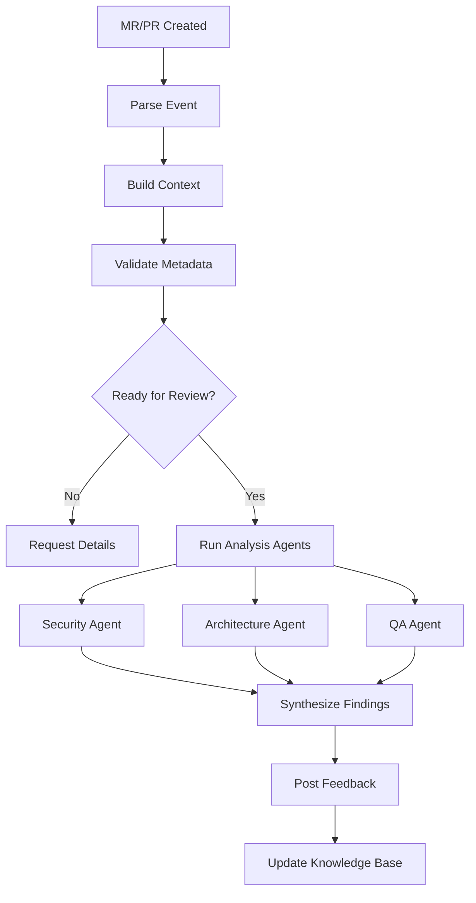

# AI Code Reviewer Documentation

Welcome to AI Code Reviewer - your autonomous code review companion! 🤖

## What is AI Code Reviewer?

AI Code Reviewer is an intelligent agent that performs automated code reviews in your CI/CD pipeline. It analyzes your merge requests and pull requests, providing constructive feedback that helps catch bugs, improve code quality, and educate developers.

## Quick Links

<div class="grid cards" markdown>

-   :rocket: __[Quick Start](getting-started/quick-start.md)__

    ---

    Get up and running in under 1 minute with our free tier setup

-   :package: __[Installation](getting-started/installation.md)__

    ---

    Detailed installation instructions for all platforms

-   :gear: __[Configuration](configuration/index.md)__

    ---

    Configure LLM providers, agents, and review settings

-   :books: __[Guides](guides/gitlab-ci.md)__

    ---

    Integration guides for GitLab CI and GitHub Actions

</div>

## Features

### 🧠 Multi-LLM Support
Works with multiple AI providers:
- **Claude** (Anthropic) - Best for complex reasoning
- **GPT** (OpenAI) - Great general purpose
- **Gemini** (Google) - Excellent free tier
- **DeepSeek** - Code-specific optimization

### 💰 Cost Optimized
Three deployment scenarios to fit your needs:
- **Solo Dev**: FREE (using provider free tiers)
- **Small Team**: $10-30/month (hybrid routing)
- **Enterprise**: Self-hosted with local LLMs

### 🔍 Intelligent Analysis
Multiple specialized agents:
- **Security Agent** - Finds vulnerabilities, hardcoded secrets
- **Architecture Agent** - Checks SOLID principles, design patterns
- **QA Agent** - Analyzes test coverage, edge cases
- **Performance Agent** - Identifies bottlenecks (coming soon)

### 🎯 Context Aware
- Learns from your codebase
- Understands project conventions
- Provides personalized feedback
- Tracks repository history

## How It Works



## Get Started

Choose your path:

=== "Quick Start (1 min)"

    Perfect for trying it out or personal projects.

    ```bash
    pip install ai-code-reviewer
    export GOOGLE_API_KEY=your_key
    ai-review gitlab --mr-iid 123 --project-id your/project
    ```

    [Full Guide →](getting-started/quick-start.md)

=== "Small Team Setup"

    For teams of 2-10 developers.

    ```yaml
    # .gitlab-ci.yml
    ai-code-review:
      image: python:3.11
      script:
        - pip install ai-code-reviewer
        - ai-review gitlab --config .ai-reviewer.yml
    ```

    [Full Guide →](deployment/small-team.md)

=== "Enterprise Setup"

    For large teams with self-hosted infrastructure.

    ```yaml
    llm:
      providers:
        - local      # Ollama
        - anthropic  # Cloud fallback
    
    webhook:
      enabled: true
    ```

    [Full Guide →](deployment/enterprise.md)

## Example Review

Here's what a review comment looks like:

!!! danger "Critical Issue: Hardcoded Secret"
    Found what appears to be an API key on line 15.

    ```python
    # ❌ Current code
    API_KEY = "sk-1234567890abcdef"
    ```

    **Risk:** High - Credentials exposed in version control

    **Recommendation:**
    ```python
    # ✅ Better approach
    import os
    API_KEY = os.getenv("API_KEY")
    if not API_KEY:
        raise ValueError("API_KEY not set")
    ```

## Why AI Code Reviewer?

### For Developers
- ✅ **Learn from feedback** - Educational, not just critical
- ✅ **Catch bugs early** - Before they reach production
- ✅ **Save time** - Automated review of routine issues
- ✅ **Consistent quality** - Same standards every time

### For Teams
- ✅ **Scale reviews** - Handle growing codebase
- ✅ **Reduce bottlenecks** - Don't wait for human reviewers
- ✅ **Onboard faster** - New devs get instant feedback
- ✅ **Track quality** - Metrics and insights

### For Companies
- ✅ **Cost effective** - Cheaper than dedicated reviewers
- ✅ **24/7 availability** - Always on, never tired
- ✅ **Compliance** - Automated security checks
- ✅ **Knowledge retention** - Learns organizational patterns

## Pricing

| Scenario | Reviews/Month | Monthly Cost |
|----------|---------------|--------------|
| Solo Developer | ~100 | **FREE** |
| Small Team | ~500 | $10-30 |
| Enterprise | ~2000 | $50-100 |

[Cost Optimization Guide →](guides/cost-optimization.md)

## Community & Support

- 📖 **Documentation**: You're reading it!
- 🐛 **Issues**: [GitHub Issues](https://github.com/your-org/ai-code-reviewer/issues)
- 💬 **Discussions**: [GitHub Discussions](https://github.com/your-org/ai-code-reviewer/discussions)
- 🗨️ **Discord**: [Join our community](https://discord.gg/your-server)

## Contributing

We welcome contributions! This project is designed for human-AI collaboration.

- Read [Contributing Guide](development/contributing.md)
- Check [Current Task](https://github.com/your-org/ai-code-reviewer/blob/main/CURRENT_TASK/TASK_DESCRIPTION.md)
- Review [Architecture](development/architecture.md)

## License

AI Code Reviewer is open source under the [MIT License](about/license.md).

---

Ready to improve your code reviews? [Get started now →](getting-started/quick-start.md)
