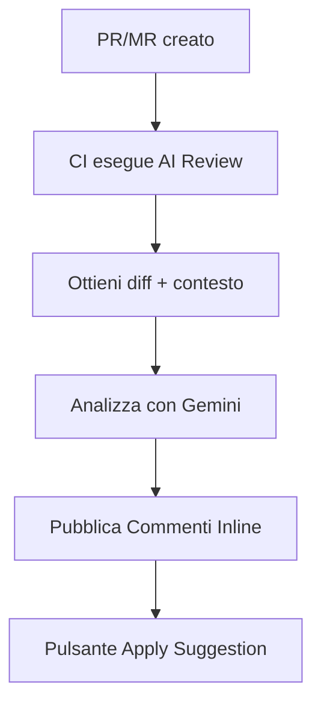

# AI ReviewBot

**Assistente basato su AI per la revisione automatica del codice nella tua pipeline CI/CD.**

---

## Cos'e?

AI Code Reviewer e uno strumento che analizza automaticamente le tue Pull Request (GitHub) e Merge Request (GitLab), trova problemi e suggerisce correzioni con un pulsante **"Apply Suggestion"**.
In sostanza, ottieni il punto di vista imparziale di uno sviluppatore senior sul tuo codice insieme a suggerimenti per migliorarlo.

E possibile l'integrazione con un'ampia gamma di provider LLM esistenti (di default **Google Gemini**, modello **gemini-2.5-flash** — al momento dell'attuale release, i limiti di utilizzo del tier gratuito per richieste al minuto e al giorno sono sufficienti per un flusso di lavoro normale di un team di 4-8 sviluppatori a tempo pieno).


---

## Cosa ottieni?


- :white_check_mark: **Commenti sul Codice** — valutazione generale del codice e raccomandazioni
- :white_check_mark: **Allineamento al Task** — allineamento del PR/MR con il contesto del task
- :white_check_mark: **Commenti Inline** — commenti direttamente sulle righe di codice
- :white_check_mark: **Apply Suggestion** — pulsante one-click per applicare le correzioni
- :white_check_mark: **Spiegazioni di Mentoring** — perche e importante + link alle risorse
- :white_check_mark: **Adattivita Linguistica** — rileva la lingua dal contesto PR/MR
- :white_check_mark: **Metriche** — tempo di esecuzione, token
- :white_check_mark: **Resilienza** — logica di retry per errori 429/5xx

---

## Quick Start

Configura AI Code Reviewer per il tuo progetto in 5 minuti:

- :octicons-mark-github-16: **[Configura review per GitHub →](quick-start.md)**
- :simple-gitlab: **[Configura review per GitLab →](quick-start.md)**

Crea un nuovo PR/MR — ottieni una revisione automaticamente.

!!! tip "Importante per la qualita della revisione"
    **La qualita della revisione dipende direttamente dalla comprensione delle tue intenzioni da parte di AI Code Reviewer** (proprio come con un revisore umano reale). Pertanto, e una buona idea accompagnare il processo di sviluppo con la documentazione:

    - **Crea un issue** che descrive il problema e i risultati desiderati
    - **Descrivi il PR/MR** — il problema in dettaglio, l'approccio alla soluzione, i vincoli, i casi limite
    - **Comunica nei commenti** — se lavori in team, tutto questo aggiunge contesto

    Piu contesto — migliore qualita della revisione!

---

## Piattaforme Supportate

| Piattaforma | Stato | Integrazione |
|-------------|-------|--------------|
| **GitHub** | :white_check_mark: | GitHub Actions / GitHub Action |
| **GitLab** | :white_check_mark: | GitLab CI / Immagine Docker |
| **Self-hosted** | :white_check_mark: | Docker / PyPI |

---

## Come funziona?



**Passo dopo passo:**

1. Crei un PR/MR
2. La pipeline CI esegue AI Code Reviewer
3. Lo strumento recupera diff, descrizione PR, task collegato
4. Gemini analizza il codice e genera raccomandazioni
5. I risultati vengono pubblicati come commenti inline con pulsante "Apply"

---

## Esempio di Revisione

!!! danger "🔴 CRITICO: Secret Hardcoded"
    **File:** `config.py:15`

    Chiave API hardcoded trovata nel codice.

    ```suggestion
    API_KEY = os.getenv("API_KEY")
    ```

    ??? info "Perche e importante?"
        I secret nel codice finiscono nella cronologia git e possono essere rubati.
        Usa variabili d'ambiente o secret manager.

        :link: [OWASP: Hardcoded Credentials](https://owasp.org/www-community/vulnerabilities/Use_of_hard-coded_password)

---

## Categorie di Problemi

| Categoria | Descrizione |
|-----------|-------------|
| :lock: **Sicurezza** | Vulnerabilita, secret hardcoded |
| :memo: **Qualita del Codice** | Leggibilita, naming, DRY |
| :building_construction: **Architettura** | SOLID, design pattern |
| :zap: **Performance** | N+1, algoritmi inefficienti |
| :test_tube: **Testing** | Copertura, casi limite |

---

## Installazione

=== "Docker (consigliato)"

    ```bash
    docker pull ghcr.io/konstziv/ai-code-reviewer:1
    ```

=== "PyPI"

    ```bash
    pip install ai-reviewbot
    ```

=== "Sorgente"

    ```bash
    git clone https://github.com/KonstZiv/ai-code-reviewer.git
    cd ai-code-reviewer
    uv sync
    ```

:point_right: [Scopri di piu →](installation.md)

---

## Configurazione

Configurazione minima — solo la chiave API:

```bash
export GOOGLE_API_KEY=your_api_key
```

Opzioni aggiuntive:

| Variabile | Descrizione | Default |
|-----------|-------------|---------|
| `AI_REVIEWER_LANGUAGE` | Lingua delle risposte (ISO 639) | `en` |
| `AI_REVIEWER_LANGUAGE_MODE` | `adaptive` / `fixed` | `adaptive` |
| `AI_REVIEWER_GEMINI_MODEL` | Modello Gemini | `gemini-2.5-flash` |
| `AI_REVIEWER_LOG_LEVEL` | Livello di logging | `INFO` |

!!! tip "Nomi legacy"
    I vecchi nomi delle variabili senza il prefisso `AI_REVIEWER_` funzionano ancora come fallback.

:point_right: [Tutte le opzioni →](configuration.md)

---

## Documentazione

<div class="grid cards" markdown>

-   :rocket: **[Quick Start](quick-start.md)**

    Istruzioni copia-incolla per GitHub e GitLab

-   :gear: **[Configurazione](configuration.md)**

    Tutte le variabili d'ambiente e opzioni

-   :octicons-mark-github-16: **[GitHub](github.md)**

    Permessi, secret, suggerimenti workflow

-   :simple-gitlab: **[GitLab](gitlab.md)**

    Project access token, trigger MR, self-hosted

-   :material-console: **[Riferimento CLI](api.md)**

    Comandi e parametri

-   :material-lifebuoy: **[Troubleshooting](troubleshooting.md)**

    FAQ e risoluzione problemi

</div>

---

## Costi

AI Code Reviewer usa **Google Gemini 3 Flash** — in modalita Free Tier. I limiti del tier gratuito sono sufficienti per servire PR/MR per un team di 4-8 sviluppatori a tempo pieno, incluse sia revisioni che commenti significativi (senza flood e off-topic).

Se usi il tier a pagamento (Pay-as-you-go), il costo di una revisione tipica e **~$0.003–$0.01**.

:bulb: ~1000 revisioni = ~$3 ... ~$10

:point_right: [Prezzi attuali →](https://ai.google.dev/gemini-api/docs/pricing)

---

## Licenza

Apache 2.0 — libero di usare, modificare e distribuire.

---

## Supporto

- :bug: [GitHub Issues](https://github.com/KonstZiv/ai-code-reviewer/issues) — bug e suggerimenti
- :speech_balloon: [GitHub Discussions](https://github.com/KonstZiv/ai-code-reviewer/discussions) — domande e discussioni

---

**Pronto a migliorare le tue code review?** :point_right: [Inizia →](quick-start.md)
